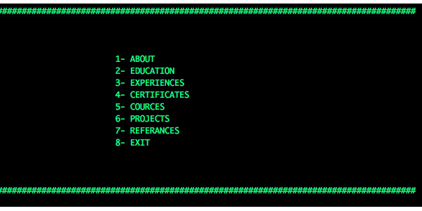
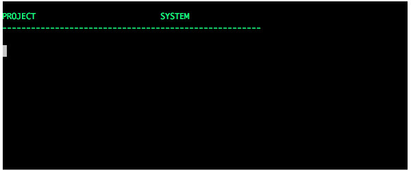

# TerminalBasedPresentation

This is a terminal based presentation example. It can be make presentation using terminal. 

# Questions?

Feel free for any suggestions, bugs, recommendations or improvements.

# THANKS
